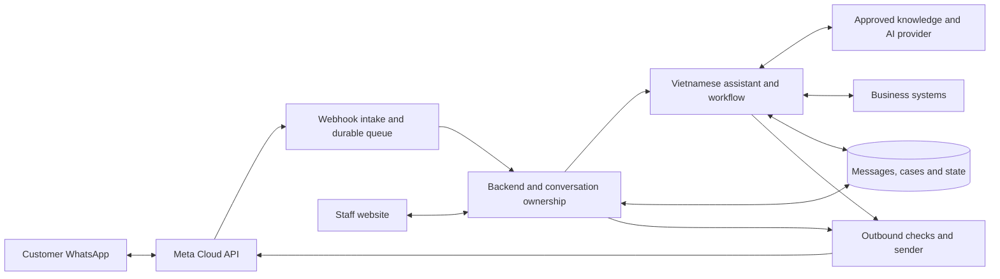

# Functional architecture, handoff and technology

## Application boundaries

Customers use WhatsApp. Staff use our web application. Meta provides the messaging transport; our backend owns conversation history, permissions, AI orchestration, workflows and human handoff.

See the [full PNG](../exports/whatsapp-architecture.png), [JPG](../exports/whatsapp-architecture.jpg) and [editable functional diagram](../exports/architecture.mmd).

## Core message flow

1. Verify the incoming webhook and durably record the event before acknowledging it.
2. Identify business number, authorized account and customer; deduplicate by provider event/message identifiers.
3. Queue and serialize work per conversation. Group rapid text bursts with a bounded delay.
4. Check conversation ownership. Human-owned/waiting conversations update the inbox without generating automatic replies.
5. For bot-owned conversations, load approved knowledge, recent context and structured workflow state.
6. Extract intent and missing fields; validate proposed actions with explicit business rules.
7. Persist the response/action intent. Immediately before sending, recheck ownership, current state and messaging eligibility.
8. Send through the correct business number. Track accepted, sent, delivered, read or failed status when available; do not equate API acceptance with delivery.

On a send timeout, do not blindly replay an externally visible action. Record uncertainty, reconcile available provider evidence and use a controlled recovery path. External actions use idempotency keys where supported and reconciliation otherwise.

## Handoff state machine

`BOT_ACTIVE → WAITING_FOR_AGENT → HUMAN_ACTIVE → RESOLVED`

Explicit staff action may move `HUMAN_ACTIVE → BOT_ACTIVE`, with updated case fields and the intended resume step. Resolving a case does not automatically authorize future automated outreach.

| Transition | Required behavior |
|---|---|
| Bot to waiting | Atomically change ownership state, invalidate queued bot replies, pause reminders, record reason and show the case in the queue |
| Waiting to human | Authenticate claimant, assign one owner atomically and notify other viewers |
| Human reply | Website sends to backend; backend checks permissions and sends through Meta from the original business number |
| Reassignment | Preserve transcript and case state; audit old/new owner |
| Return to bot | Staff explicitly selects resume, confirms context and unlocks automation |
| Nobody available | Keep visible waiting status; tell customer the request is queued; escalate internally without inventing an ETA |

Before every outbound bot send, compare the current ownership/version with the state used to generate it. This prevents an in-flight AI reply from appearing after staff takeover. Incoming customer messages during handoff remain stored and visible.

The staff website does not expose Meta tokens to the browser. Staff do not use personal WhatsApp numbers to reply. Mobile Business App coexistence is not required for this design; assess eligibility separately if requested.

## Multi-account design

Use business/workspace ID and connected-number ID throughout conversations, knowledge, actions and access checks. Keep the original business sender for every reply. An identical customer phone number in unrelated businesses must not merge records or authorize cross-business visibility.

Demo: one connected number but account-aware persistence and routing. Complete phase: validate at least two numbers and agree the actual capacity target. Meta eligibility and limits must be checked for the selected accounts; unlimited linking is not promised.

## Technology recommendation

These are proposed choices, not existing implementation. Revalidate versions, model availability, pricing and provider constraints before procurement or build.

| Layer | Recommendation | Demo approach / later extension |
|---|---|---|
| Messaging | Official Meta WhatsApp Cloud API | Real send/receive path from the first vertical slice |
| Staff web app | Next.js, React, TypeScript | Minimal inbox and cases first |
| Backend | NestJS, TypeScript | One modular backend rather than many services |
| Live updates | WebSockets | Reconnect and reload persisted history after disconnect |
| Database | PostgreSQL | Durable events, messages, cases, ownership, workflow state and audit |
| Workers | Redis and BullMQ | Per-conversation processing, bounded retries and scheduled jobs |
| AI | Gemini Flash as an initial evaluation candidate; replaceable provider adapter | Confirm exact model only after Vietnamese evaluation; no unverified claim that it is best |
| Knowledge | Curated approved text for demo; PostgreSQL plus pgvector if needed later | Exact business facts come from authoritative records, not semantic guesses |
| Workflow | Persisted backend state machine | Fixed intake workflow first; React Flow editor only if prioritized in phase two |
| Media | Private S3-compatible object storage | Access controls, size/type limits and retention |
| Runtime | Docker; managed database and queue infrastructure | Staging/demo environment, then separately configured production |
| Operations | Structured logs, error monitoring and metrics | Redact personal content; alert on queue backlog, send failures and unassigned cases |

React Flow draws a workflow editor; it does not execute durable workflows. BullMQ schedules work; PostgreSQL remains the source of truth for business and conversation state.

## Minimum persistent records

Workspaces, staff memberships, connected numbers, customers, conversations, messages, webhook events, case records, workflow definitions/versions, workflow runs, assignments, outbound attempts and audit events. Add knowledge revisions and reminder schedules as those features arrive.

Separate conversation ownership from case stage. For example, a case may be awaiting customer confirmation while staff own the conversation.

## Platform and safety boundaries

- Messaging-window and template rules apply to staff as well as bots.
- Staff access, webhook verification and secret management are demo requirements, not phase-two polish.
- Knowledge updates require review; do not automatically promote customer conversations into trusted instructions.
- Demo and pilot use consenting testers and synthetic business details. Document retention and deletion before real customer use.
- The provider's account setup and message eligibility are external dependencies. Local UI success cannot substitute for a real WhatsApp acceptance test.

References: [Meta Cloud API](https://www.postman.com/meta/whatsapp-business-platform/documentation/wlk6lh4/whatsapp-cloud-api), [WhatsApp policy](https://business.whatsapp.com/policy), [Next.js](https://nextjs.org/docs), [NestJS WebSockets](https://docs.nestjs.com/websockets/gateways), [BullMQ retry guidance](https://docs.bullmq.io/guide/retrying-failing-jobs), [pgvector](https://github.com/pgvector/pgvector), [React Flow](https://reactflow.dev/), [Gemini model documentation](https://ai.google.dev/gemini-api/docs/models).
